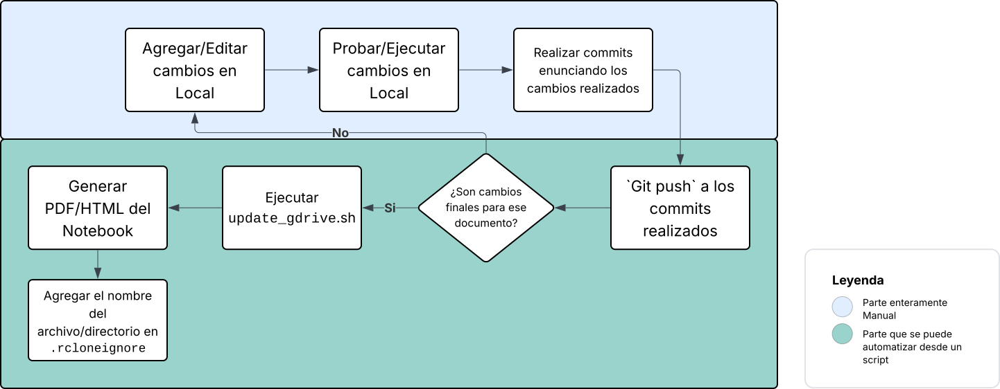

# 03MIAR - Algoritmos de Optimización

Este repositorio alberga las Actividades Guiadas correspondientes a la Asignatura Algoritmos de Optimización que se imparte en el Máster de Inteligencia Artificial en la Universidad Internacional de Valencia (VIU).

Periodo académico 2025 - 2026

## Actividades Guiadas:

### [Actividad Guiada 1 (AG1)](./AG1/Algoritmos AG1(Divide y vencerás,Voraz,Backtracking).ipynb):

* Torres de Hanoi (Divide y Vencerás / Variante Iterativa)
* Cambio de monedas (Técnica Voraz)
* N-Reinas (Backtracking)
* [Ejercicio Extra] Par de puntos más cercanos en 1-Dimensión, 2-Dimensiones y 3-Dimensiones (Divide y Vencerás)

### [Actividad Guiada 2 (AG2)](./AG2/Algoritmos_AG2.ipynb): 

* Viaje por el río (Programación Dinámica / Variante con Dijkstra)
* Problema de Asignación de tareas (Ramificación y Poda)
* Descenso del Gradiente
* [Ejercicio Extra] Estimar límite computacional aceptable para el problema de Asignacion de tareas.
* [Ejercicio Extra] Obtener el descenso de gradiente de la función $f(x)=sin(1/2 * x^2 - 1/4 * y^2 + 3) * cos(2*x + 1 - e^y)$

### Actividad Guiada 3 (AG3): TODO

### Actividad Guiada 4 (AG4): TODO

## Demostraciones en el Foro Debatible:

### Post sobre el ejercicio de elementos repetidos en dos listas:

En [este notebook](./EjercicioSesion1.ipynb) presento algunas formas de resolver este problema con complejidades temporales que van desde $O(N)$, $O(N \log N)$ y $O(N^2)$. 

Propongo un análisis tanto temporal, como espacial, recalcando sus ventajas y desventajas respectivamente.

### Post sobre el $N$-ésimo término de la Serie de Fibonacci

En [este notebook](./SecuenciaDeFibonacci.ipynb) presento 7 formas de encontrar el $N$-ésimo término de la serie de Fibonacci, haciendo uso de distintas estrategias tanto algorítmicas como matemáticas, en cada forma o variante presento su respectiva ventaja, desventaja o limitación técnica.

Teóricamente, se pueden lograr complejidades temporales de $O(\log N)$, pero 
existen ciertos matices y variables ocultas.

Propongo un análisis tanto temporal, como espacial.

## Sobre el cómo gestionar los archivos tanto en Github, como en Google Drive

Dado que es de mi preferencia desarrollar desde mi IDE favorito, y no desde 
Google Colab, he encontrado una forma de _automatizar_ la actualización de 
los notebooks tanto en Github como en Google Drive sin tener que actualizar 
los documentos por separado manualmente.

### Workflow



La herramienta usada para actualizar desde terminal los archivos locales a 
Google Drive se llama [Rclone](https://rclone.org/), es una herramienta 
OpenSource que permite sincronizar archivos unidireccional o bidireccional a 
multiples proveedores de almacenamiento en la nube.

Para ello es necesario seguir los siguientes pasos:
1. En Google Drive crear una carpeta (en este caso la llamaremos `03MIAR`)
2. [Instalar RClone](https://rclone.org/install/) en el sistema operativo de preferencia
3. Ejecutar el comando `rclone config`
   1. Crear una nueva conexión remota, para ello se debe ingresar `n` y 
      luego presionamos Enter
   2. Debes asignarle un nuevo nombre, se sugiere usar el mismo del paso 1 
      `03MIAR`
   3. Buscar "Google Drive" en la lista de proveedores, en este punto se 
      requiere ingresar un número acorde al proveedor, y Google Drive suele 
      ser el número `18` o alguno cercano a este. Presionamos Enter una vez 
      ingresado el número del proveedor.
   4. A menos que lo requiera, se deja en blanco `client_id`, y 
      `client_secret`. 
   5. En la opción de elegir el nivel de acceso, se debe elegir `Full Access`, 
      que es el numero `1`.
   6. Sigue las instrucciones para autenticarte desde tu navegador.
4. Si tienes archivos o directorios que no deseas que se suban o actualicen 
   en Google Drive, agrégalos en el archivo `.rcloneignore`
5. Para verificar que todo está correctamente configurado, en el directorio 
   donde está el repositorio clonado se ejecuta este comando:
```bash
rclone sync /ruta/repo 03MIAR:03MIAR --exclude-from /ruta/repo/.rcloneignore -P
```
Ejecutar este comando creará los archivos que no existan en el directorio 
`03MIAR` en Google Drive, y actualizará (sin duplicar o sobreescribir) 
aquellos archivos que ya existan en la nube. Ignorará aquellos que están 
definidos en `.rcloneignore`

Esto es beneficioso dado que si ya el archivo en GDrive tiene un enlace de 
compartido y se realizan cambios en local de ese archivo, sincronizar los 
cambios con rclone no sobreescribirá este archivo, lo cual actualiza el 
contenido del archivo sin perder el enlace de compartidos.

El subcomando `sync` realiza una sincronización unidireccional, desde el 
equipo o pc local hasta la carpeta asignada de GoogleDrive.

